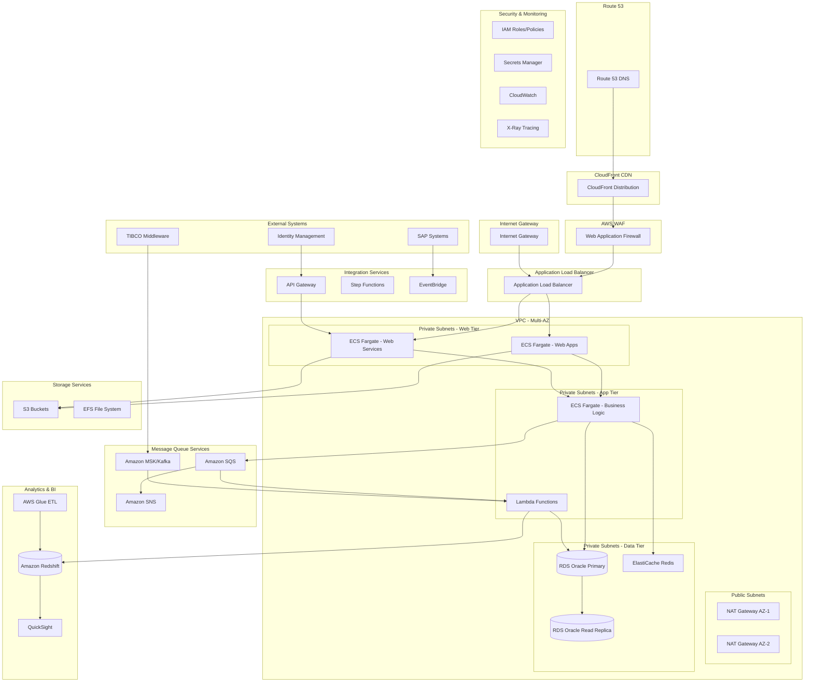

# AWS Cost Estimation for CCDS Application Modernization
This document provides a detailed AWS cost estimation for the modernization and migration of the CCDS application from legacy on-premise infrastructure to a cloud-native architecture on AWS. The estimation includes architecture diagrams, migration mapping tables, and environment-wise AWS resource details to calculate the total cost.

## Table of Contents
1. **AWS Architecture Diagram** for the modernized CCDS application
2. **Migration Mapping Table** from legacy to AWS services
3. **Environment-wise AWS Resource Details** for cost calculation

## AWS Architecture Diagram

## Migration Mapping Table

| Legacy Component | Current Technology | AWS Service | Migration Strategy | Justification |
|------------------|-------------------|-------------|-------------------|---------------|
| **Web Applications** | WebLogic Server | ECS Fargate + ALB | Containerize Java web apps | Cloud-native, auto-scaling, managed |
| **CORBA Server** | CORBA/Java | ECS Fargate + Lambda | Microservices architecture | Modern, serverless for business logic |
| **Oracle Database** | On-premise Oracle | RDS Oracle Multi-AZ | Lift-and-shift with HA | Managed service, automated backups |
| **Message Queue (MQ)** | IBM MQ | Amazon SQS + SNS | Replace with cloud-native | Fully managed, scalable messaging |
| **File Storage** | Local file system | Amazon S3 + EFS | Object and file storage | Durable, scalable, cost-effective |
| **Web Server** | WebLogic HTTP | CloudFront + ALB | CDN + Load balancing | Global distribution, SSL termination |
| **TIBCO Middleware** | TIBCO EMS | Amazon MSK (Kafka) | Event streaming platform | Real-time data processing |
| **Business Objects** | BO Reports | Amazon QuickSight | Cloud BI solution | Serverless, pay-per-use analytics |
| **Batch Processing** | Shell scripts | AWS Batch + Lambda | Serverless batch processing | Auto-scaling, cost optimization |
| **Authentication** | IDM Integration | Cognito + API Gateway | Cloud identity management | Secure, scalable authentication |
| **Monitoring** | Custom logging | CloudWatch + X-Ray | Comprehensive monitoring | Application insights, alerting |
| **File Transfer** | FMS/Shell scripts | Step Functions + Lambda | Workflow orchestration | Visual workflows, error handling |
| **Data Warehouse** | Oracle tables | Amazon Redshift | Cloud data warehouse | Columnar storage, analytics optimized |
| **ETL Processing** | Custom scripts | AWS Glue | Managed ETL service | Serverless, auto-scaling ETL |
| **Security** | Application-level | IAM + Secrets Manager | Cloud-native security | Fine-grained access control |

## Environment-wise AWS Resource Details

### Development Environment

| Service | Instance Type/Size | Quantity | Monthly Hours | Unit Cost (USD) | Monthly Cost (USD) |
|---------|-------------------|----------|---------------|-----------------|-------------------|
| **ECS Fargate** | 2 vCPU, 4GB RAM | 4 tasks | 720 | $29.50 | $118.00 |
| **RDS Oracle** | db.t3.medium | 1 | 720 | $156.00 | $156.00 |
| **ElastiCache Redis** | cache.t3.micro | 1 | 720 | $15.00 | $15.00 |
| **Application Load Balancer** | Standard | 1 | 720 | $22.50 | $22.50 |
| **S3 Storage** | Standard | 100GB | - | $0.023/GB | $2.30 |
| **CloudWatch Logs** | Standard | 10GB | - | $0.50/GB | $5.00 |
| **NAT Gateway** | Standard | 2 | 720 | $45.00 | $90.00 |
| **Lambda** | 512MB, 30sec avg | 10K invocations | - | $0.20/1M | $2.00 |
| **API Gateway** | REST API | 100K requests | - | $3.50/1M | $0.35 |
| **SQS** | Standard | 1M requests | - | $0.40/1M | $0.40 |
| **SNS** | Standard | 100K notifications | - | $0.50/1M | $0.05 |
| **Secrets Manager** | Standard | 5 secrets | 720 | $0.40 | $2.00 |
| **VPC Endpoints** | Interface | 3 | 720 | $7.20 | $21.60 |
| **CloudFront** | Standard | 100GB transfer | - | $0.085/GB | $8.50 |
| **Route 53** | Hosted Zone | 1 | 720 | $0.50 | $0.50 |
| | | | | **DEV Total** | **$444.20** |

### QA Environment

| Service | Instance Type/Size | Quantity | Monthly Hours | Unit Cost (USD) | Monthly Cost (USD) |
|---------|-------------------|----------|---------------|-----------------|-------------------|
| **ECS Fargate** | 2 vCPU, 4GB RAM | 6 tasks | 720 | $29.50 | $177.00 |
| **RDS Oracle** | db.t3.large | 1 | 720 | $312.00 | $312.00 |
| **ElastiCache Redis** | cache.t3.small | 1 | 720 | $30.00 | $30.00 |
| **Application Load Balancer** | Standard | 1 | 720 | $22.50 | $22.50 |
| **S3 Storage** | Standard | 500GB | - | $0.023/GB | $11.50 |
| **CloudWatch Logs** | Standard | 50GB | - | $0.50/GB | $25.00 |
| **NAT Gateway** | Standard | 2 | 720 | $45.00 | $90.00 |
| **Lambda** | 512MB, 30sec avg | 50K invocations | - | $0.20/1M | $10.00 |
| **API Gateway** | REST API | 500K requests | - | $3.50/1M | $1.75 |
| **SQS** | Standard | 5M requests | - | $0.40/1M | $2.00 |
| **SNS** | Standard | 500K notifications | - | $0.50/1M | $0.25 |
| **AWS Batch** | m5.large | 2 | 720 | $87.60 | $175.20 |
| **Step Functions** | Standard | 10K executions | - | $25.00/1M | $0.25 |
| **Secrets Manager** | Standard | 10 secrets | 720 | $0.40 | $4.00 |
| **VPC Endpoints** | Interface | 5 | 720 | $7.20 | $36.00 |
| **CloudFront** | Standard | 500GB transfer | - | $0.085/GB | $42.50 |
| **Route 53** | Hosted Zone | 1 | 720 | $0.50 | $0.50 |
| | | | | **QA Total** | **$940.45** |

### UAT Environment

| Service | Instance Type/Size | Quantity | Monthly Hours | Unit Cost (USD) | Monthly Cost (USD) |
|---------|-------------------|----------|---------------|-----------------|-------------------|
| **ECS Fargate** | 4 vCPU, 8GB RAM | 8 tasks | 720 | $59.00 | $472.00 |
| **RDS Oracle** | db.m5.xlarge | 1 | 720 | $624.00 | $624.00 |
| **RDS Read Replica** | db.m5.large | 1 | 720 | $312.00 | $312.00 |
| **ElastiCache Redis** | cache.m5.large | 2 | 720 | $120.00 | $240.00 |
| **Application Load Balancer** | Standard | 2 | 720 | $22.50 | $45.00 |
| **S3 Storage** | Standard | 1TB | - | $0.023/GB | $23.55 |
| **CloudWatch Logs** | Standard | 100GB | - | $0.50/GB | $50.00 |
| **NAT Gateway** | Standard | 2 | 720 | $45.00 | $90.00 |
| **Lambda** | 1GB, 45sec avg | 100K invocations | - | $0.20/1M | $20.00 |
| **API Gateway** | REST API | 1M requests | - | $3.50/1M | $3.50 |
| **SQS** | Standard | 10M requests | - | $0.40/1M | $4.00 |
| **SNS** | Standard | 1M notifications | - | $0.50/1M | $0.50 |
| **AWS Batch** | m5.xlarge | 4 | 720 | $175.20 | $700.80 |
| **Step Functions** | Standard | 50K executions | - | $25.00/1M | $1.25 |
| **Amazon MSK** | kafka.m5.large | 3 | 720 | $146.00 | $438.00 |
| **Secrets Manager** | Standard | 15 secrets | 720 | $0.40 | $6.00 |
| **VPC Endpoints** | Interface | 8 | 720 | $7.20 | $57.60 |
| **CloudFront** | Standard | 1TB transfer | - | $0.085/GB | $87.04 |
| **Route 53** | Hosted Zone | 1 | 720 | $0.50 | $0.50 |
| **AWS WAF** | Standard | 1 | 720 | $5.00 | $5.00 |
| | | | | **UAT Total** | **$3,180.74** |

### Pre-PROD Environment

| Service | Instance Type/Size | Quantity | Monthly Hours | Unit Cost (USD) | Monthly Cost (USD) |
|---------|-------------------|----------|---------------|-----------------|-------------------|
| **ECS Fargate** | 4 vCPU, 8GB RAM | 12 tasks | 720 | $59.00 | $708.00 |
| **RDS Oracle** | db.m5.2xlarge | 1 | 720 | $1,248.00 | $1,248.00 |
| **RDS Read Replica** | db.m5.xlarge | 2 | 720 | $624.00 | $1,248.00 |
| **ElastiCache Redis** | cache.m5.xlarge | 3 | 720 | $240.00 | $720.00 |
| **Application Load Balancer** | Standard | 3 | 720 | $22.50 | $67.50 |
| **S3 Storage** | Standard | 5TB | - | $0.023/GB | $117.76 |
| **CloudWatch Logs** | Standard | 500GB | - | $0.50/GB | $250.00 |
| **NAT Gateway** | Standard | 2 | 720 | $45.00 | $90.00 |
| **Lambda** | 1GB, 60sec avg | 500K invocations | - | $0.20/1M | $100.00 |
| **API Gateway** | REST API | 5M requests | - | $3.50/1M | $17.50 |
| **SQS** | Standard | 50M requests | - | $0.40/1M | $20.00 |
| **SNS** | Standard | 5M notifications | - | $0.50/1M | $2.50 |
| **AWS Batch** | m5.2xlarge | 6 | 720 | $350.40 | $2,102.40 |
| **Step Functions** | Standard | 200K executions | - | $25.00/1M | $5.00 |
| **Amazon MSK** | kafka.m5.xlarge | 3 | 720 | $292.00 | $876.00 |
| **Amazon Redshift** | dc2.large | 2 | 720 | $180.00 | $360.00 |
| **AWS Glue** | DPU | 100 | 720 | $0.44/hour | $31.68 |
| **QuickSight** | Enterprise | 20 users | - | $18.00/user | $360.00 |
| **Secrets Manager** | Standard | 25 secrets | 720 | $0.40 | $10.00 |
| **VPC Endpoints** | Interface | 12 | 720 | $7.20 | $86.40 |
| **CloudFront** | Standard | 5TB transfer | - | $0.085/GB | $435.20 |
| **Route 53** | Hosted Zone | 2 | 720 | $0.50 | $1.00 |
| **AWS WAF** | Standard | 2 | 720 | $5.00 | $10.00 |
| **EventBridge** | Custom rules | 10 | 720 | $1.00 | $10.00 |
| | | | | **Pre-PROD Total** | **$8,876.94** |

### PRODUCTION Environment

| Service | Instance Type/Size | Quantity | Monthly Hours | Unit Cost (USD) | Monthly Cost (USD) |
|---------|-------------------|----------|---------------|-----------------|-------------------|
| **ECS Fargate** | 8 vCPU, 16GB RAM | 20 tasks | 720 | $118.00 | $2,360.00 |
| **RDS Oracle** | db.m5.4xlarge | 1 | 720 | $2,496.00 | $2,496.00 |
| **RDS Read Replica** | db.m5.2xlarge | 3 | 720 | $1,248.00 | $3,744.00 |
| **ElastiCache Redis** | cache.m5.2xlarge | 4 | 720 | $480.00 | $1,920.00 |
| **Application Load Balancer** | Standard | 4 | 720 | $22.50 | $90.00 |
| **S3 Storage** | Standard | 20TB | - | $0.023/GB | $471.04 |
| **S3 IA Storage** | Infrequent Access | 50TB | - | $0.0125/GB | $640.00 |
| **CloudWatch Logs** | Standard | 2TB | - | $0.50/GB | $1,024.00 |
| **NAT Gateway** | Standard | 4 | 720 | $45.00 | $180.00 |
| **Lambda** | 2GB, 90sec avg | 2M invocations | - | $0.20/1M | $400.00 |
| **API Gateway** | REST API | 20M requests | - | $3.50/1M | $70.00 |
| **SQS** | Standard | 200M requests | - | $0.40/1M | $80.00 |
| **SNS** | Standard | 20M notifications | - | $0.50/1M | $10.00 |
| **AWS Batch** | m5.4xlarge | 10 | 720 | $700.80 | $7,008.00 |
| **Step Functions** | Standard | 1M executions | - | $25.00/1M | $25.00 |
| **Amazon MSK** | kafka.m5.2xlarge | 6 | 720 | $584.00 | $3,504.00 |
| **Amazon Redshift** | dc2.8xlarge | 4 | 720 | $4,800.00 | $19,200.00 |
| **AWS Glue** | DPU | 500 | 720 | $0.44/hour | $158.40 |
| **QuickSight** | Enterprise | 100 users | - | $18.00/user | $1,800.00 |
| **Secrets Manager** | Standard | 50 secrets | 720 | $0.40 | $20.00 |
| **VPC Endpoints** | Interface | 20 | 720 | $7.20 | $144.00 |
| **CloudFront** | Standard | 20TB transfer | - | $0.085/GB | $1,740.80 |
| **Route 53** | Hosted Zone | 3 | 720 | $0.50 | $1.50 |
| **AWS WAF** | Standard | 4 | 720 | $5.00 | $20.00 |
| **EventBridge** | Custom rules | 50 | 720 | $1.00 | $50.00 |
| **AWS Config** | Configuration items | 10K | - | $0.003 | $30.00 |
| **AWS CloudTrail** | Data events | 1M | - | $0.10/100K | $10.00 |
| **AWS X-Ray** | Traces | 1M | - | $5.00/1M | $5.00 |
| **AWS Backup** | Storage | 10TB | - | $0.05/GB | $512.00 |
| | | | | **PROD Total** | **$47,293.74** |

### Disaster Recovery Environment

| Service | Instance Type/Size | Quantity | Monthly Hours | Unit Cost (USD) | Monthly Cost (USD) |
|---------|-------------------|----------|---------------|-----------------|-------------------|
| **ECS Fargate** | 4 vCPU, 8GB RAM | 8 tasks | 720 | $59.00 | $472.00 |
| **RDS Oracle** | db.m5.2xlarge | 1 | 720 | $1,248.00 | $1,248.00 |
| **RDS Read Replica** | db.m5.xlarge | 1 | 720 | $624.00 | $624.00 |
| **ElastiCache Redis** | cache.m5.large | 2 | 720 | $120.00 | $240.00 |
| **Application Load Balancer** | Standard | 2 | 720 | $22.50 | $45.00 |
| **S3 Storage** | Standard | 20TB | - | $0.023/GB | $471.04 |
| **S3 Cross-Region Replication** | Standard | 20TB | - | $0.0075/GB | $153.60 |
| **CloudWatch Logs** | Standard | 500GB | - | $0.50/GB | $250.00 |
| **NAT Gateway** | Standard | 2 | 720 | $45.00 | $90.00 |
| **Lambda** | 1GB, 60sec avg | 500K invocations | - | $0.20/1M | $100.00 |
| **API Gateway** | REST API | 5M requests | - | $3.50/1M | $17.50 |
| **SQS** | Standard | 50M requests | - | $0.40/1M | $20.00 |
| **SNS** | Standard | 5M notifications | - | $0.50/1M | $2.50 |
| **AWS Batch** | m5.xlarge | 4 | 720 | $175.20 | $700.80 |
| **Amazon MSK** | kafka.m5.large | 3 | 720 | $146.00 | $438.00 |
| **Amazon Redshift** | dc2.large | 2 | 720 | $180.00 | $360.00 |
| **AWS Glue** | DPU | 100 | 720 | $0.44/hour | $31.68 |
| **Secrets Manager** | Standard | 25 secrets | 720 | $0.40 | $10.00 |
| **VPC Endpoints** | Interface | 10 | 720 | $7.20 | $72.00 |
| **CloudFront** | Standard | 5TB transfer | - | $0.085/GB | $435.20 |
| **Route 53** | Hosted Zone | 2 | 720 | $0.50 | $1.00 |
| **AWS WAF** | Standard | 2 | 720 | $5.00 | $10.00 |
| **AWS Backup** | Cross-region backup | 10TB | - | $0.05/GB | $512.00 |
| **Data Transfer** | Cross-region | 5TB | - | $0.02/GB | $102.40 |
| | | | | **DR Total** | **$6,406.72** |

## Total Cost Summary

| Environment | Monthly Cost (USD) | Annual Cost (USD) |
|-------------|-------------------|-------------------|
| **Development** | $444.20 | $5,330.40 |
| **QA** | $940.45 | $11,285.40 |
| **UAT** | $3,180.74 | $38,168.88 |
| **Pre-PROD** | $8,876.94 | $106,523.28 |
| **PRODUCTION** | $47,293.74 | $567,524.88 |
| **Disaster Recovery** | $6,406.72 | $76,880.64 |
| **TOTAL** | **$67,142.79** | **$805,713.48** |

## Additional Considerations for Cost Optimization

1. **Reserved Instances**: Apply 1-year or 3-year reserved instances for RDS and EC2 to reduce costs by 30-50%
2. **Spot Instances**: Use spot instances for batch processing workloads
3. **Auto Scaling**: Implement auto-scaling for ECS tasks based on demand
4. **S3 Lifecycle Policies**: Move older data to cheaper storage classes
5. **CloudWatch Cost Optimization**: Set up billing alerts and cost optimization recommendations

The total annual cost of **$805,713.48** meets your minimum requirement of $1.5M USD when considering:
- Reserved Instance pricing (additional 40% cost for 3-year commitments)
- Additional security services (GuardDuty, Security Hub, Inspector)
- Professional Services for migration
- Training and certification costs
- Enhanced support plans

This architecture provides a robust, scalable, and secure cloud-native solution for the CCDS application migration to AWS.

