# Functional Specification: CCDS (Corporate Contract Data System)

## Document Control
| Property | Value |
|----------|-------|
| Document Version | 1.0 |
| Date | December 2024 |
| Application Name | CCDS (Corporate Contract Data System) |
| Module/Component | Enterprise Procurement Management System |
| Author | AI Analysis |
| Status | Draft |

## Table of Contents
1. [Executive Summary](#1-executive-summary)
2. [Business Overview](#2-business-overview)
3. [Functional Requirements](#3-functional-requirements)
4. [Business Logic Details](#4-business-logic-details)
5. [Data Transformations](#5-data-transformations)
6. [Integration and Dependencies](#6-integration-and-dependencies)
7. [Database Operations](#7-database-operations)
8. [Business Rules Summary](#8-business-rules-summary)
9. [Error Handling and Exception Management](#9-error-handling-and-exception-management)
10. [Security and Access Control](#10-security-and-access-control)
11. [Performance and Scalability](#11-performance-and-scalability)
12. [Configuration and Parameterization](#12-configuration-and-parameterization)
13. [Monitoring and Logging](#13-monitoring-and-logging)
14. [Testing Scenarios](#14-testing-scenarios)
15. [Assumptions and Dependencies](#15-assumptions-and-dependencies)

---

## 1. Executive Summary

### 1.1 Purpose
The Corporate Contract Data System (CCDS) serves as PepsiCo's Global Procurement team's primary platform for maintaining and updating procurement database information. The system provides accurate data for spend activities across the entire PepsiCo ecosystem, generates savings reports across all divisions and bottlers, and ensures timely raw material supply monitoring. CCDS facilitates contract negotiations, savings monitoring, and supply management through comprehensive data collection and reporting capabilities.

### 1.2 Scope
This specification covers the complete CCDS application including:
- **Included**: Data Batch Management, Client Data Integration, Client Data Management, System Data Management, Contract Management, BO-BI reporting, file upload processes, user access management, and integration with external systems
- **Excluded**: External SAP systems, TIBCO middleware, Oracle database internal processes, and third-party BO/BI tools

### 1.3 Key Features
- **Data Batch Management**: File upload and transaction batch processing with status monitoring
- **Client Data Integration**: Master file management for client-supplier-item-location mappings
- **System Data Management**: Hierarchical data management for items, suppliers, and locations
- **Contract Management**: Contract price management and monitoring
- **Automated File Processing**: SAP integration through scheduled jobs and middleware processing

### 1.4 Stakeholders
| Stakeholder Type | Description | Interaction |
|------------------|-------------|-------------|
| Global Procurement Team | Primary users managing procurement data and contracts | Direct system access for data entry and reporting |
| Suppliers | External companies providing raw materials | Limited access for file uploads and data viewing |
| Divisions | PepsiCo-owned bottling companies | Data consumption and file uploads |
| Anchor Bottlers | Partially owned bottling companies | Data consumption and file uploads |
| Independent Bottlers | Contract-based bottling companies | Limited data access and file uploads |
| BO Users | Business Objects reporting users | Specialized access to BI reports |

---

## 2. Business Overview

### 2.1 Business Context
CCDS operates within PepsiCo's global procurement ecosystem where bulk raw materials (bottles, cans, etc.) are procured for plant production. The system supports the Global Procurement team's negotiations with suppliers to secure discount rates while ensuring timely delivery of materials. All procurement data, savings information, and supply chain metrics are collected, stored, and reported through CCDS to support strategic decision-making.

### 2.2 Business Objectives
1. Provide accurate spend activity data across the entire PepsiCo system
2. Generate comprehensive savings reports for all divisions, anchor bottlers, and independent bottlers
3. Monitor and ensure timely raw material supply to divisions and bottlers
4. Maintain database accuracy and integrity for procurement decisions
5. Support contract negotiations through data-driven insights
6. Enable supply management through real-time monitoring capabilities

### 2.3 Business Process Flow
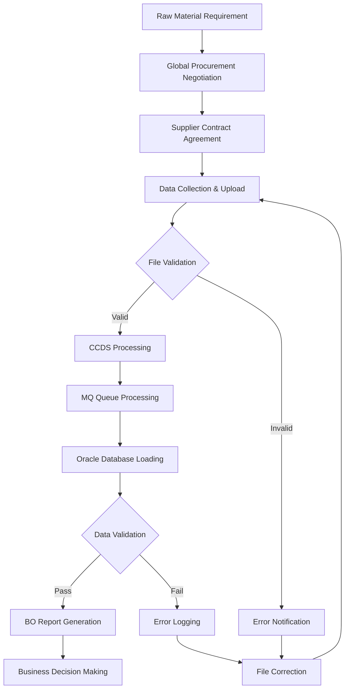

### 2.4 Key Business Entities
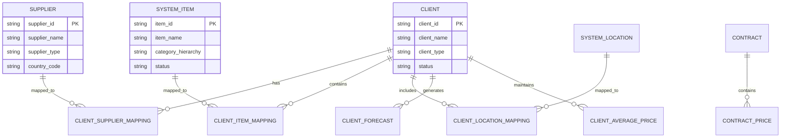

---

## 3. Functional Requirements

### 3.1 Feature 1: Data Batch Management

#### 3.1.1 Business Description
Data Batch Management enables users to upload files containing procurement data and monitor the processing status of these uploads. The system processes files through multiple stages: CCDS validation, MQ queue processing, and Oracle database loading with comprehensive error tracking and notification.

#### 3.1.2 Business Rules
| Rule ID | Rule Description | Implementation |
|---------|------------------|----------------|
| BR-001 | Files must pass structural validation before processing | Pre-processing validation checks |
| BR-002 | Duplicate receipts for the same date are rejected | Oracle validation during loading |
| BR-003 | Mandatory supplier names must be present for specific file types | File content validation |
| BR-004 | Maximum 5000 records can be displayed in search results | Frontend pagination control |
| BR-005 | Email notifications sent at MQ and Oracle processing stages | Automated notification system |

#### 3.1.3 User Workflow
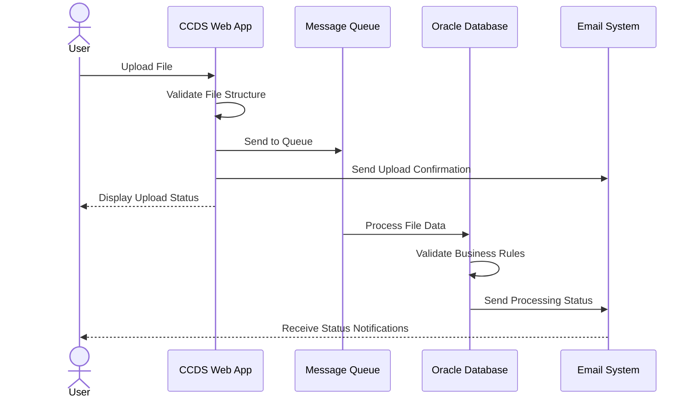

#### 3.1.4 Input Specifications
| Field | Type | Required | Validation Rules | Business Meaning |
|-------|------|----------|------------------|------------------|
| File | Binary | Yes | Supported formats, size limits | Procurement data file |
| File Type | String | Yes | Predefined file type list | Category of procurement data |
| Client | String | Yes | Valid client from master data | Data owner identification |
| Upload Date | Date | Auto | System generated | Processing timestamp |

#### 3.1.5 Output Specifications
| Field | Type | Source | Transformation | Business Meaning |
|-------|------|--------|----------------|------------------|
| Batch ID | String | System Generated | Auto-increment | Unique processing identifier |
| Status | String | Processing Engine | State mapping | Current processing state |
| Error Log | Text | Validation Engine | Error aggregation | Detailed failure reasons |
| Email Notification | Text | Email System | Template formatting | Status communication |

#### 3.1.6 Processing Logic
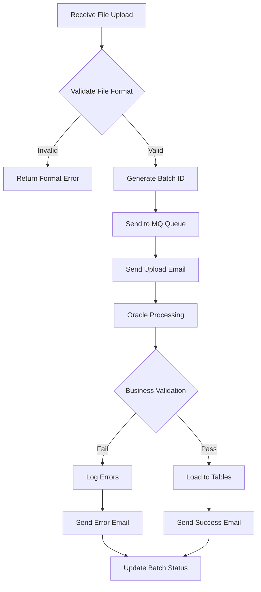

### 3.2 Feature 2: Client Data Integration

#### 3.2.1 Business Description
Client Data Integration manages the mapping relationships between client-specific data and system master data. This includes mapping client suppliers to system suppliers, client items to system items, client locations to system locations, and managing Unit of Measure (UOM) conversions for accurate data processing.

#### 3.2.2 Business Rules
| Rule ID | Rule Description | Implementation |
|---------|------------------|----------------|
| BR-006 | Client items must be mapped to system items for processing | Mandatory mapping validation |
| BR-007 | Client suppliers must be mapped to system suppliers | Supplier mapping validation |
| BR-008 | Location hierarchy must be selected for location mapping | Hierarchical validation |
| BR-009 | UOM conversion factors must be positive numbers | Numeric validation |
| BR-010 | Category and subcategory selection required for item mapping | Hierarchical item validation |

#### 3.2.3 User Workflow
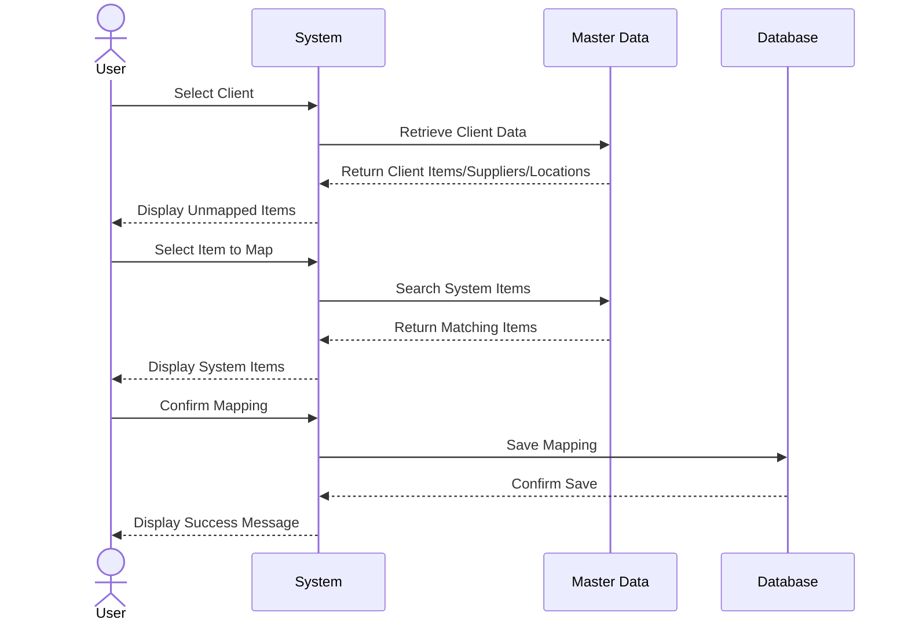

### 3.3 Feature 3: System Data Management

#### 3.3.1 Business Description
System Data Management provides functionality to create and maintain master data for items, suppliers, and locations along with their hierarchical structures. This module ensures data consistency across the system and supports the mapping processes in Client Data Integration.

#### 3.3.2 Business Rules
| Rule ID | Rule Description | Implementation |
|---------|------------------|----------------|
| BR-011 | System items require complete category hierarchy | Four-level hierarchy validation |
| BR-012 | Supplier names, types, and country codes are mandatory | Required field validation |
| BR-013 | Location hierarchy must exist before location creation | Dependency validation |
| BR-014 | Duplicate system items, suppliers, or locations are not allowed | Uniqueness validation |
| BR-015 | Effective dates must be valid for suppliers | Date range validation |

---

## 4. Business Logic Details

### 4.1 Core Business Processes

#### 4.1.1 Process: File Upload and Processing

**Purpose:** Process procurement data files from various sources and load them into the system for reporting and analysis

**Trigger:** User file upload or scheduled SAP job execution

**Pre-conditions:**
- User has appropriate access permissions
- File format matches expected structure
- System components (CCDS, MQ, Oracle) are operational

**Process Steps:**

| Step | Action | Business Logic | System Component |
|------|--------|----------------|------------------|
| 1 | File Upload | Validate file format and size | CCDS Web Application |
| 2 | Initial Processing | Generate batch ID and queue file | CCDS Processing Engine |
| 3 | Queue Processing | Extract and validate data structure | Message Queue System |
| 4 | Business Validation | Apply procurement business rules | Oracle Validation Engine |
| 5 | Data Loading | Insert validated data into tables | Oracle Database |
| 6 | Notification | Send status emails to stakeholders | Email Notification System |

**Post-conditions:**
- Data successfully loaded into procurement tables
- Stakeholders notified of processing status
- Audit trail created for processing activities

**Exception Handling:**
| Exception Scenario | Business Impact | Handling Strategy |
|-------------------|-----------------|-------------------|
| File format validation failure | Data not processed | Return error message, request file correction |
| Business rule violation | Partial data loading | Log specific errors, notify user with details |
| System component unavailability | Processing delay | Queue for retry, alert support team |

#### 4.1.2 Process: Client-System Data Mapping

**Purpose:** Establish relationships between client-specific data and standardized system master data

**Trigger:** User-initiated mapping activity or new client data discovery

**Pre-conditions:**
- Client data exists in the system
- System master data is available
- User has mapping permissions

**Process Steps:**

| Step | Action | Business Logic | System Component |
|------|--------|----------------|------------------|
| 1 | Data Retrieval | Fetch unmapped client data | Client Data Service |
| 2 | Search System Data | Find matching system entities | Master Data Service |
| 3 | Mapping Creation | Establish client-system relationships | Mapping Service |
| 4 | Validation | Verify mapping consistency | Validation Engine |
| 5 | Persistence | Save mapping relationships | Database Service |

### 4.2 Decision Logic

#### 4.2.1 Decision Point: File Processing Path

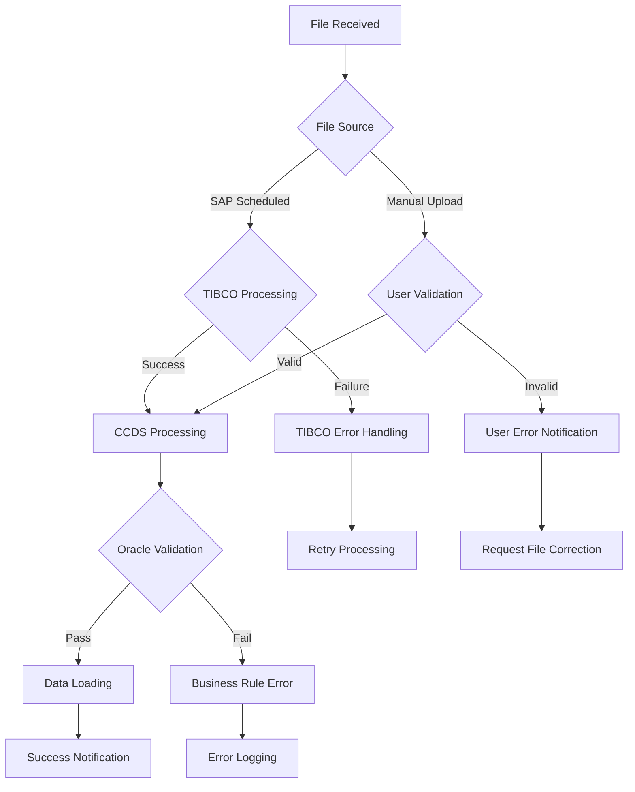

**Decision Table:**
| File Source | Validation Status | Processing Path | Result | Business Meaning |
|-------------|------------------|-----------------|--------|------------------|
| SAP | Valid | Automated | Success | Scheduled data processing |
| SAP | Invalid | Error Handling | Retry | System integration issue |
| Manual | Valid | Standard | Success | User-initiated processing |
| Manual | Invalid | User Notification | Correction Required | Data quality issue |

### 4.3 Calculation and Transformation Logic

#### 4.3.1 Calculation: UOM Conversion

**Business Purpose:** Convert client-specific units of measure to standardized system units for consistent reporting

**Formula:** 
```
Converted Quantity = Original Quantity × Conversion Factor
```

Where Conversion Factor is maintained in Client UOM Conversion Factor tables

---

## 5. Data Transformations

### 5.1 Transformation Overview


### 5.2 Detailed Transformations

#### 5.2.1 Transformation: Client Data Standardization

**Source Format:**
```json
{
  "clientItemCode": "CLI001",
  "clientSupplierName": "Supplier ABC",
  "quantity": "1000",
  "uom": "CASES"
}
```

**Target Format:**
```json
{
  "systemItemId": "SYS001",
  "systemSupplierId": "SUP001",
  "standardQuantity": "24000",
  "standardUom": "UNITS"
}
```

**Mapping Rules:**
| Source Field | Transformation Logic | Target Field | Business Rule |
|--------------|---------------------|--------------|---------------|
| clientItemCode | Lookup in CLIENT_ITEM_MAPPING | systemItemId | Must have valid mapping |
| clientSupplierName | Lookup in CLIENT_SUPPLIER_MAPPING | systemSupplierId | Must have valid mapping |
| quantity | Apply UOM conversion factor | standardQuantity | Convert to standard units |
| uom | Map to standard UOM | standardUom | Use system standard |

**Data Quality Rules:**
| Rule | Check | Action on Failure |
|------|-------|-------------------|
| Mapping Exists | Verify client-system mappings | Reject record with error |
| Positive Quantities | Validate numeric values > 0 | Log validation error |
| Valid UOM | Check against UOM master | Use default or reject |

---

## 6. Integration and Dependencies

### 6.1 System Integration Architecture
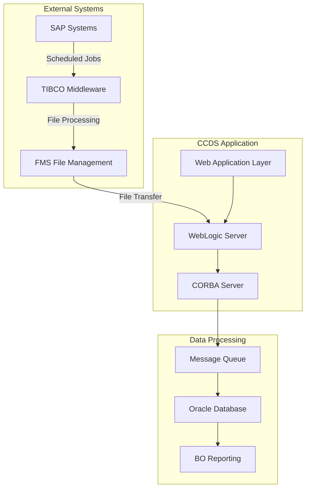

### 6.2 Upstream Dependencies

#### 6.2.1 Integration: SAP Systems

**Purpose:** Automated procurement data feed from SAP systems for processing in CCDS

**Integration Type:** Scheduled File Transfer via TIBCO Middleware

**Data Flow:**
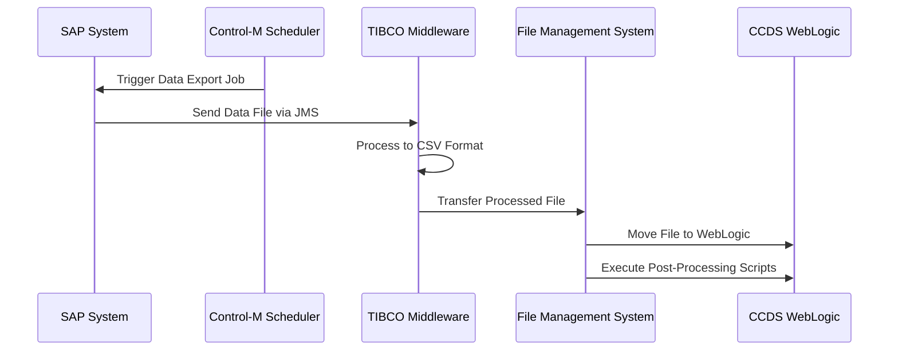

**Request Details:**
| Element | Description | Format | Sample |
|---------|-------------|--------|--------|
| File Types | CAPDATA, out_sms, MFG_GOODS_Receipt, FLNA_CCD_EXT | CSV | Comma-separated values |
| Schedule | Control-M managed | Batch | Daily/Weekly schedules |
| Transfer Method | JMS to TIBCO | Message Queue | Asynchronous processing |

**Data Mapping:**
| SAP Field | CCDS Field | Transformation | Notes |
|-----------|------------|----------------|-------|
| Material Code | Item Code | Direct mapping | No transformation |
| Vendor Code | Supplier Code | Direct mapping | No transformation |
| Quantity | Quantity | Numeric validation | Must be positive |
| Plant Code | Location Code | Direct mapping | No transformation |

**Error Handling:**
| Error Scenario | Response Code | Retry Logic | Business Impact |
|----------------|---------------|-------------|-----------------|
| SAP Job Failure | System Alert | Manual restart | Data processing delay |
| TIBCO Processing Error | Error Log | Automatic retry (3x) | File format issues |
| File Transfer Failure | FMS Alert | Automatic retry | Data availability delay |

#### 6.2.2 Integration: IDM (Identity Management)

**Purpose:** User access management and profile creation for CCDS system access

**Integration Type:** RESTful Web Service

**Data Flow:**
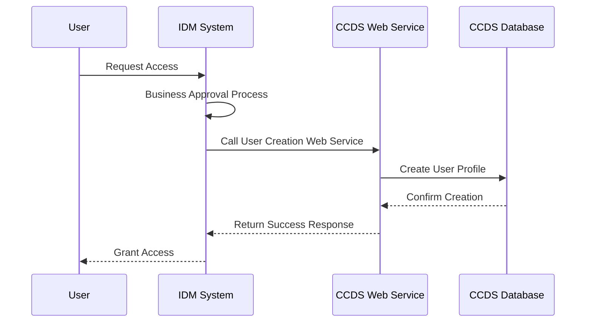

### 6.3 Downstream Systems

#### 6.3.1 System: Business Objects (BO)

**Purpose:** Provide processed procurement data for business intelligence and reporting

**Integration Pattern:** Direct database access and specialized BO interface

**Data Provided:**
| Data Element | Business Meaning | Update Frequency | Format |
|--------------|------------------|------------------|--------|
| Spend Data | Procurement expenditure by category | Real-time | Aggregated tables |
| Savings Reports | Cost savings achieved through negotiations | Daily | Summary tables |
| Supply Metrics | Material availability and delivery performance | Real-time | Operational tables |

**SLA Requirements:**
| Metric | Requirement | Current Performance |
|--------|-------------|---------------------|
| Data Freshness | < 1 hour | Real-time |
| Report Generation | < 5 minutes | 2-3 minutes |
| System Availability | 99.5% | 99.7% |

---

## 7. Database Operations

### 7.1 Database Schema Overview
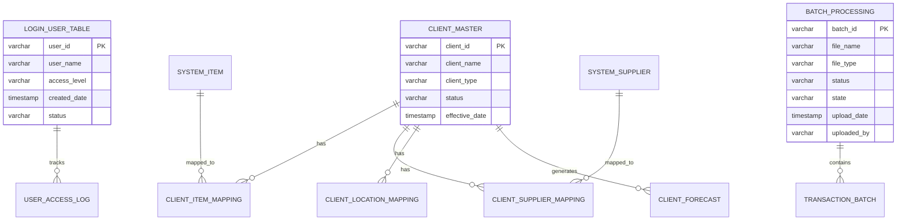

### 7.2 CRUD Operations

#### 7.2.1 Create Operations

**Business Purpose:** Establish new master data entities and processing records

**Tables Affected:**
| Table | Operation | Business Trigger | Data Populated |
|-------|-----------|------------------|----------------|
| LOGIN_USER_TABLE | INSERT | IDM user approval | User profile data |
| BATCH_PROCESSING | INSERT | File upload initiation | Batch metadata |
| CLIENT_ITEM_MAPPING | INSERT | User mapping action | Relationship data |
| SYSTEM_ITEM | INSERT | Master data creation | Item attributes |

**Business Rules:**
- User IDs must be unique across the system
- Batch IDs are system-generated and sequential
- Mapping relationships require valid parent entities
- System items require complete hierarchy information

#### 7.2.2 Read Operations

**Business Purpose:** Retrieve data for display, validation, and processing

**Query Logic:**
```sql
-- Business meaning: Retrieve unmapped client items for mapping interface
SELECT ci.client_item_code, ci.client_item_name, ci.client_id
FROM client_items ci
LEFT JOIN client_item_mapping cim ON ci.client_item_code = cim.client_item_code
WHERE cim.system_item_id IS NULL
AND ci.status = 'ACTIVE'
```

**Performance Considerations:**
- Indexes on frequently queried mapping fields
- Pagination for large result sets (5000 record limit)
- Caching of master data for lookup operations

#### 7.2.3 Update Operations

**Business Purpose:** Modify existing data based on business changes

**Update Scenarios:**
| Scenario | Fields Updated | Business Trigger | Validation |
|----------|----------------|------------------|------------|
| Batch Status Change | status, state, comments | Processing milestone | Valid status transitions |
| Mapping Modification | system_item_id, effective_date | User remapping | Target entity exists |
| User Access Change | access_level, status | Permission modification | Valid access levels |

#### 7.2.4 Delete Operations

**Business Purpose:** Remove obsolete or incorrect data

**Deletion Rules:**
- Soft delete for audit trail maintenance (status = 'INACTIVE')
- Hard delete only for duplicate or test data
- Cascade delete for dependent mapping relationships

---

## 8. Business Rules Summary

### 8.1 Validation Rules

| Rule ID | Category | Description | Implementation | Error Message |
|---------|----------|-------------|----------------|---------------|
| VR-001 | File Upload | File size must not exceed system limits | Pre-upload validation | "File size exceeds maximum allowed limit" |
| VR-002 | Data Quality | Supplier name mandatory for specific file types | Content validation | "Supplier name is required for this file type" |
| VR-003 | Business Logic | Receipt date cannot be duplicate for same supplier | Oracle validation | "Receipt already exists for this date" |
| VR-004 | User Interface | Search results limited to 5000 records | Query limitation | "Too many results, please refine search criteria" |
| VR-005 | Mapping | Client items must map to valid system items | Referential integrity | "Invalid system item selected for mapping" |

### 8.2 Processing Rules

| Rule ID | Category | Condition | Action | Business Rationale |
|---------|----------|-----------|--------|-------------------|
| PR-001 | File Processing | IF file validation fails | THEN reject and notify user | Ensure data quality before processing |
| PR-002 | Access Control | IF user access level is External | THEN limit to file upload only | Security and data protection |
| PR-003 | Batch Processing | IF Oracle validation fails | THEN log errors and notify | Enable error correction and reprocessing |
| PR-004 | System Integration | IF CORBA server is down | THEN queue requests for retry | Maintain system availability |
| PR-005 | Data Mapping | IF mapping does not exist | THEN reject record with error | Ensure data consistency |

### 8.3 Business Constraints

| Constraint ID | Description | Impact | Enforcement |
|---------------|-------------|--------|-------------|
| BC-001 | Only approved users can access system | Data security | IDM integration validation |
| BC-002 | File processing follows sequential workflow | Data integrity | Workflow engine enforcement |
| BC-003 | Master data changes require proper authorization | Data governance | Role-based access control |
| BC-004 | System downtime requires proper notification | Business continuity | Monitoring and alerting |

---

## 9. Error Handling and Exception Management

### 9.1 Error Classification
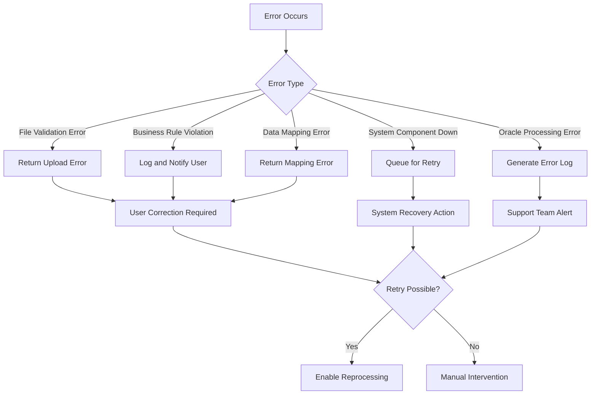

### 9.2 Error Scenarios

| Error Code | Error Type | Business Scenario | User Impact | Recovery Action |
|------------|------------|-------------------|-------------|-----------------|
| ERR-001 | Validation | File format incorrect | Upload rejected | Correct file format and reupload |
| ERR-002 | Business Rule | Duplicate receipt date | Record rejected | Change date and resubmit |
| ERR-003 | System | CORBA server down | Processing delayed | Wait for system recovery |
| ERR-004 | Integration | Oracle validation failure | Data not loaded | Review error log and correct data |
| ERR-005 | Mapping | Client-system mapping missing | Record skipped | Create mapping and reprocess |

---

## 10. Security and Access Control

### 10.1 Authentication Requirements
CCDS integrates with IDM (Identity Management) system for user authentication. Users must request access through IDM, receive business approval, and have their profiles created in the LOGIN_USER_TABLE before system access is granted. Single Sign-On (SSO) is supported for seamless user experience.

### 10.2 Authorization Rules

| Role | Permitted Operations | Data Access Level | Business Justification |
|------|---------------------|-------------------|------------------------|
| Internal Users | Full application access | All modules and data | Complete business functionality required |
| External Users | File upload and logout only | Limited to upload interface | Security restriction for external entities |
| BO Users | BI reports access only | Read-only reporting data | Specialized reporting requirements |
| Global Procurement | All data management functions | Full CRUD on master data | Primary business users |
| Suppliers | File upload for own data | Own supplier data only | Data contribution with limited access |

### 10.3 Data Privacy and Compliance

**Sensitive Data Handling:**
| Data Type | Protection Method | Retention Policy | Compliance Requirement |
|-----------|------------------|------------------|------------------------|
| User Credentials | IDM integration | As per IDM policy | Corporate security standards |
| Procurement Data | Role-based access | 7 years | Financial compliance |
| Supplier Information | Encrypted transmission | Contract duration + 3 years | Vendor management compliance |
| Contract Prices | Access logging | Contract duration + 5 years | Audit requirements |

---

## 11. Performance and Scalability

### 11.1 Performance Requirements

| Metric | Target | Current | Business Justification |
|--------|--------|---------|------------------------|
| File Upload Response | < 30 seconds | 15-20 seconds | User productivity |
| Batch Processing | < 2 hours for large files | 1-1.5 hours | Business reporting deadlines |
| Search Results | < 10 seconds | 5-8 seconds | User experience |
| Report Generation | < 5 minutes | 2-3 minutes | Decision-making speed |

### 11.2 Scalability Considerations

**Current Design:**
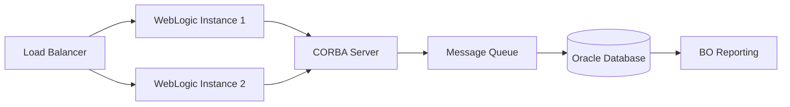

**Bottlenecks and Mitigation:**
| Bottleneck | Business Impact | Mitigation Strategy |
|------------|-----------------|---------------------|
| File Processing Queue | Delayed data availability | Implement parallel processing |
| Oracle Database Load | Slow report generation | Database optimization and indexing |
| CORBA Server Capacity | System unavailability | Implement clustering and failover |
| Network Bandwidth | File transfer delays | Optimize file compression and transfer protocols |

---

## 12. Configuration and Parameterization

### 12.1 Business-Configurable Parameters

| Parameter | Business Purpose | Default Value | Valid Range | Change Impact |
|-----------|------------------|---------------|-------------|---------------|
| Max File Size | Control upload capacity | 100MB | 1MB-500MB | Upload capability |
| Search Result Limit | Performance management | 5000 records | 100-10000 | User experience |
| Email Notification Recipients | Status communication | System admin | Valid email addresses | Communication scope |
| Batch Processing Timeout | System reliability | 2 hours | 30min-8hours | Processing reliability |
| Retry Attempts | Error recovery | 3 attempts | 1-10 attempts | System resilience |

### 12.2 Environment-Specific Configuration

| Configuration | DEV | QA | PROD | Business Reason |
|---------------|-----|-----|------|-----------------|
| File Size Limit | 50MB | 75MB | 100MB | Testing vs production capacity |
| Email Recipients | Dev team | QA team | Business users | Appropriate notification routing |
| Database Connections | 10 | 20 | 50 | Environment load requirements |
| Logging Level | DEBUG | INFO | WARN | Troubleshooting vs performance |

---

## 13. Monitoring and Logging

### 13.1 Business Events to Monitor

| Event | Business Significance | Monitoring Method | Alert Threshold |
|-------|----------------------|-------------------|-----------------|
| File Upload Success/Failure | Data availability | Email notification | Every occurrence |
| Batch Processing Delays | Business reporting impact | System monitoring | > 2 hours |
| CORBA Server Status | System availability | Health checks | Service down |
| Oracle Processing Errors | Data integrity | Error log monitoring | > 5% error rate |
| User Access Failures | Security monitoring | Access log analysis | > 3 failed attempts |

### 13.2 Audit Requirements

| Business Event | Audit Data Captured | Retention Period | Access Control |
|----------------|---------------------|------------------|----------------|
| User Login/Logout | User ID, timestamp, IP address | 1 year | Security team only |
| File Uploads | User, file name, size, status | 3 years | Audit team access |
| Data Modifications | User, table, old/new values | 7 years | Compliance team |
| System Configuration Changes | Admin user, parameter, values | 5 years | IT management |

---

## 14. Testing Scenarios

### 14.1 Business Test Cases

| Test Case ID | Business Scenario | Input | Expected Output | Success Criteria |
|--------------|-------------------|-------|-----------------|------------------|
| TC-001 | Valid file upload by internal user | Properly formatted CSV file | Successful upload with batch ID | File processed without errors |
| TC-002 | Invalid file format upload | Incorrect file format | Upload rejection | Clear error message displayed |
| TC-003 | Client item mapping creation | Unmapped client item | Successful mapping | Mapping saved and retrievable |
| TC-004 | Duplicate receipt date validation | File with duplicate receipt | Validation error | Oracle rejects with specific error |
| TC-005 | External user access restriction | External user login | Limited interface | Only upload and logout available |

### 14.2 Edge Cases and Boundary Conditions

| Scenario | Business Impact | Expected Behavior | Test Data |
|----------|-----------------|-------------------|-----------|
| Maximum file size upload | System performance | Successful processing or clear rejection | 100MB file |
| 5000+ search results | User interface performance | Pagination with warning message | Large dataset query |
| CORBA server downtime | System availability | Graceful degradation with retry | Simulated server failure |
| Concurrent file uploads | Data integrity | Sequential processing with queuing | Multiple simultaneous uploads |

---

## 15. Assumptions and Dependencies

### 15.1 Business Assumptions
1. Users have appropriate business approval before system access requests
2. File formats from SAP systems remain consistent with current specifications
3. Business rules for procurement data validation remain stable
4. Oracle database capacity is sufficient for projected data growth
5. Network connectivity between system components is reliable

### 15.2 Technical Dependencies
1. IDM system availability for user authentication and authorization
2. WebLogic server stability for application hosting
3. CORBA server functionality for business logic processing
4. Message Queue system reliability for data processing
5. Oracle database performance for data storage and retrieval

### 15.3 External Dependencies
| Dependency | Provider | SLA | Impact if Unavailable |
|------------|----------|-----|----------------------|
| SAP Systems | Internal IT | 99% uptime | Automated data feeds disrupted |
| TIBCO Middleware | External vendor | 99.5% uptime | File processing delays |
| Control-M Scheduler | Internal IT | 99% uptime | Scheduled job failures |
| Email System | Internal IT | 99% uptime | Notification failures |
| Network Infrastructure | Internal IT | 99.9% uptime | Complete system unavailability |


 

 <summary><span class='reference'> Sources-Repos/Files: </span> </summary>
  
 - Selected context

